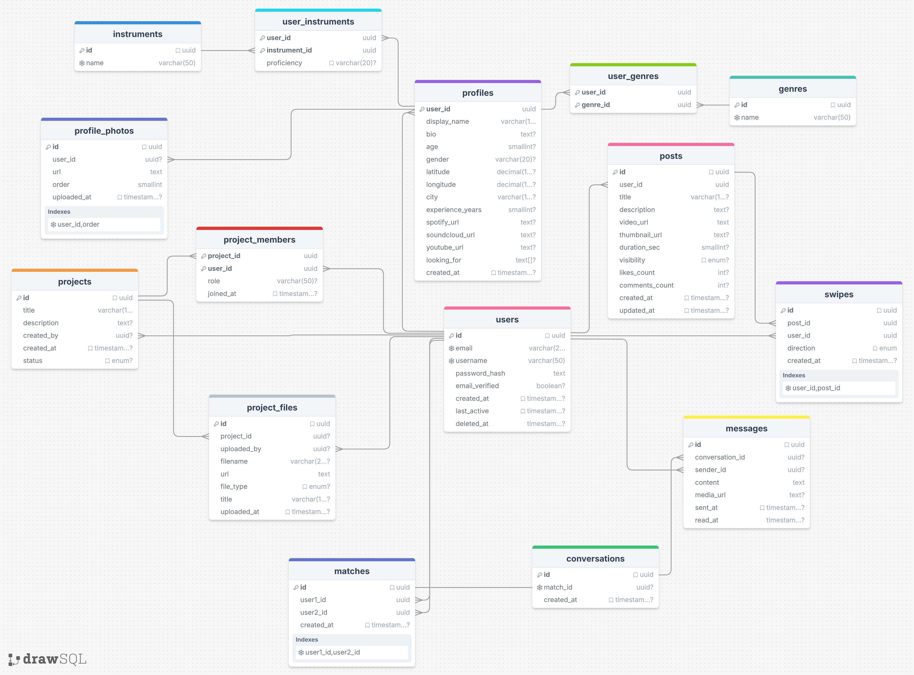

# BandMate Database Schema Explanation

## Table of Contents
- [Database Schema Explanation](#database-schema-explanation)
- [Database Schema Diagram](#database-schema-diagram)
- [Database Migrations](#database-migrations)

This document outlines the database schema for BandMate, detailing the tables and their relationships. The schema is designed to support user profiles, musical preferences, project collaboration, and social interactions within the platform.

## Table Relationships Overview

The database is structured around key entities such as `users`, `profiles`, `instruments`, `genres`, `posts`, `projects`, and `conversations`. Relationships are established primarily through foreign keys, ensuring data integrity and enabling efficient querying of related information.

Here's a breakdown of the main tables and their connections:

### 1. `users` Table
- Stores core user authentication and account information.
- **`id`**: Unique identifier for each user.
- **`profiles.user_id`**: One-to-one relationship with `users.id`. Each user has exactly one profile.
- **`posts.user_id`**: One-to-many relationship. A user can create multiple posts.
- **`swipes.user_id`**: One-to-many relationship. A user can perform multiple swipes.
- **`matches.user1_id`, `matches.user2_id`**: Many-to-many relationship (through `matches` table). Users can be matched with other users.
- **`messages.sender_id`**: One-to-many relationship. A user can send multiple messages.
- **`projects.created_by`**: One-to-many relationship. A user can create multiple projects.
- **`project_members.user_id`**: Many-to-many relationship (through `project_members` table). Users can be members of multiple projects.
- **`project_files.uploaded_by`**: One-to-many relationship. A user can upload multiple files to projects.

### 2. `profiles` Table
- Stores detailed public profile information for users.
- **`user_id`**: Primary key and foreign key referencing `users.id`. This establishes a one-to-one relationship.
- **`profile_photos.user_id`**: One-to-many relationship. A profile can have multiple photos.
- **`user_instruments.user_id`**: One-to-many relationship (through `user_instruments` table). A profile can be associated with multiple instruments.
- **`user_genres.user_id`**: One-to-many relationship (through `user_genres` table). A profile can be associated with multiple genres.

### 3. `profile_photos` Table
- Stores URLs and order for profile pictures.
- **`user_id`**: Foreign key referencing `profiles.user_id`.

### 4. `instruments` Table
- A lookup table for different musical instruments.
- **`user_instruments.instrument_id`**: Many-to-many relationship with `profiles.user_id` through the `user_instruments` join table.

### 5. `genres` Table
- A lookup table for different musical genres.
- **`user_genres.genre_id`**: Many-to-many relationship with `profiles.user_id` through the `user_genres` join table.

### 6. `user_instruments` Table (Join Table)
- Links users to the instruments they play, along with their proficiency.
- Composite primary key: (`user_id`, `instrument_id`).

### 7. `user_genres` Table (Join Table)
- Links users to their preferred musical genres.
- Composite primary key: (`user_id`, `genre_id`).

### 8. `posts` Table
- Stores user-generated content, such as videos and musical ideas.
- **`user_id`**: Foreign key referencing `users.id`.
- **`swipes.post_id`**: One-to-many relationship. A post can be swiped on by multiple users.

### 9. `swipes` Table
- Records user interactions (like, pass, superlike) on posts.
- **`user_id`**: Foreign key referencing `users.id`.
- **`post_id`**: Foreign key referencing `posts.id`.

### 10. `matches` Table
- Records successful mutual likes between users.
- **`user1_id`, `user2_id`**: Foreign keys referencing `users.id`. Ensures each match is unique and ordered.
- **`conversations.match_id`**: One-to-one relationship. Each match can have one conversation.

### 11. `conversations` Table
- Initiated upon a successful match between two users.
- **`match_id`**: Foreign key referencing `matches.id`. Unique constraint ensures one conversation per match.
- **`messages.conversation_id`**: One-to-many relationship. A conversation can have multiple messages.

### 12. `messages` Table
- Stores individual messages within a conversation.
- **`conversation_id`**: Foreign key referencing `conversations.id`.
- **`sender_id`**: Foreign key referencing `users.id`.

### 13. `projects` Table
- Facilitates musical collaboration among users.
- **`created_by`**: Foreign key referencing `users.id`.
- **`project_members.project_id`**: Many-to-many relationship with `users.id` through `project_members` table.
- **`project_files.project_id`**: One-to-many relationship. A project can have multiple files.

### 14. `project_members` Table (Join Table)
- Defines which users are part of a specific project and their role.
- Composite primary key: (`project_id`, `user_id`).

### 15. `project_files` Table
- Stores files (audio, lyrics, etc.) associated with a project.
- **`project_id`**: Foreign key referencing `projects.id`.
- **`uploaded_by`**: Foreign key referencing `users.id`.

## Database Schema Diagram

Below is a visual representation of the BandMate database schema, illustrating the tables and their interconnections.



## Database Migrations
### (Development Instructions)

This section provides instructions for developers on how to manage and apply database migrations using `npx supabase` commands. These commands are crucial for evolving the database schema in a controlled manner.

### 1. Link your Supabase project (if not already linked)

If you haven't already, link your local Supabase CLI to your remote Supabase project:

```bash
npx supabase login
npx supabase link --project-ref <your-project-ref>
```

Replace `<your-project-ref>` with your actual Supabase project reference ID.

### 2. Start the Supabase local development environment

To work with migrations locally, ensure your Supabase local development environment is running:

```bash
npx supabase start
```

This command spins up a local instance of PostgreSQL, PostgREST, Auth, Storage, and other Supabase services.

### 3. Generate a new migration

When you make changes to your local database schema (e.g., adding a new table, altering a column), you need to generate a migration script.
You can create an empty migration file with a descriptive name using the following command:

```bash
npx supabase migration new <migration-name>
```

Replace `<migration-name>` with a descriptive name for your migration (e.g., `add_posts_table`, `update_user_profiles`). This command will create a new empty SQL file in the `supabase/migrations` directory. You will then manually add the SQL commands for your schema changes to this file.

### 4. Apply migrations to your local database

To apply pending migrations (including newly generated ones) to your local Supabase database:

```bash
npx supabase db push
```

This command reads all migration files in `supabase/migrations` and applies them in order to your local database. It also resets the local database if necessary.

### 5. Reset your local database

If you need to completely reset your local database to its initial state (e.g., to clear all data and reapply all migrations from scratch):

```bash
npx supabase db reset
```

Use this command with caution, as it will delete all data in your local development database.

### 6. Apply migrations to a remote database

To apply migrations to your remote Supabase project (e.g., staging or production), after you have created and populated your migration files locally:

```bash
npx supabase db push --linked
```

**Important:** Always test your migration locally before pushing to a remote environment. Ensure that the migration files in your `supabase/migrations` directory accurately reflect the desired changes.

By following these steps, you can effectively manage your BandMate database schema changes and ensure consistency across development, staging, and production environments.